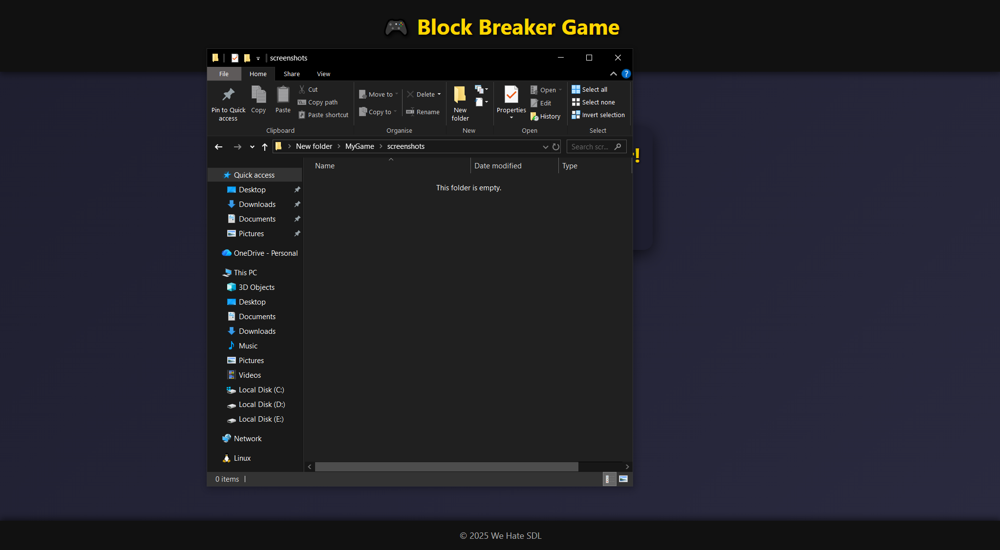
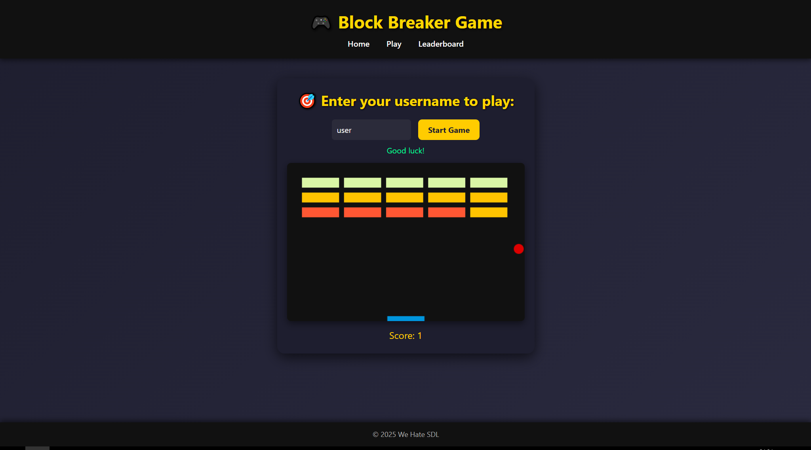
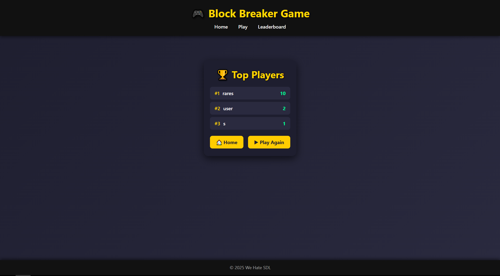

**BlockBreaker Server (Django Application)**

A Django-based backend server for a browser-playable BlockBreaker clone.
This project provides the game backend, including persistent player data, score submissions, and a public leaderboard. It exposes lightweight REST endpoints for interacting with the game client and includes the Django Admin interface for data management.

**Screenshots**





**Features**

Django project configured as a backend for a BlockBreaker game.

API endpoints for submitting scores and retrieving the leaderboard.

Database-backed player profiles and score history.

Automatic leaderboard ordering and validation.

Django Admin for inspecting and moderating player data.

**Requirements**

Python 3.10 or later

Django 4.x or 5.x

SQLite database backend

**Installation and Build Steps**

1. Clone the Repository
```
git clone https://github.com/RaresPx/BlockBreaker_WebGame
cd blockbreaker-server
```

2. Create and Activate a Virtual Environment
```
python3 -m venv venv

#Linux:

source venv/bin/activate

#Windows:

venv\Scripts\activate
```
3. Install Dependencies
```
pip install -r requirements.txt
```
4. Apply Migrations
```
python manage.py migrate
```
5. Create an Admin User
```
python manage.py createsuperuser
```
6. Run the Development Server
```
python manage.py runserver
```

**The server will be available at:**
http://127.0.0.1:8000/